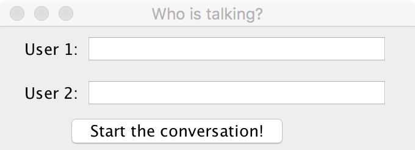

## ChatV2
## Homework 5
## Due:  November 18, 11:30 PM

## Objectives
* To work in a team
* To use files and exception handling
* To refactor and extend code

## Assignment Overview

In this assignment, you will take your solution from Homework 4 and extend it to add a few features.  Specifically, 
* Your revised code will write a conversation to a file so that it can be loaded into the conversation window when the user resumes a conversation
* Your revised code should be able to handle multiple simultaneous conversations between different users.

Try to make these changes with minimal changes to the existing code.  Main will obviously need to change, but try to build on the existing Observer pattern to implement your changes.

## Details

**Saving a conversation to a file**

In order that a conversation can be resumed, if the chat program is quit and restarted, the conversation should be saved to a file.  When the program restarts, if the file exists, it should be loaded into the conversation and displayed.

To do this, you should create a class that encapsulates the file.  It should be a listener to the conversation so that the file is written as the conversation is occurring.  Whenever you write to the file, be sure to call the flush method after writing a line.  When you call write, Java will save the data in a buffer that it only periodically writes to the disk/solid state drive.  When you call flush, it forces the write to disk/solid state drive to happen immediately.  This ensures that everything will be saved when the user quits the program.

Design decisions:
* You need to decide how to name the file and where to store it so that it can be found again when the user restarts the program.
* You need to handle exceptions that may occur when reading and saving files.  How will you handle these?  When do you need to report errors to the user?
* Can you add a file writer to a conversation without changing your model classes?
* Can you load a conversation from a file without changing your model classes?

**Handling multiple simultaneous conversations**
To allow for multiple simultaneous conversations, the user will need to identify the participants in the conversation.  For example, when the program starts, you can display a window like this:

After filling in both names and clicking the button, a pair of windows for that conversation should be created, as in the previous assignment.

The window shown above should remain on the screen so that another conversation can be started between a different pair of people.

Design decisions:
* How does your program keep track of multiple simultaneous conversations?
* What user errors can arise with this new screen, and how will you report those to the user?
* If both windows for a conversation are closed by the user, how do you close the conversation itself?  In particular, how do you close the file that the conversation was being written to?

## Working in a team
You should start by discussing the different approaches you each took in Homework 4 and decide whose code you want to use as the starting point in this homework.  The person whose code you want to use as a starting point for this assignment should clone the Homework 5 repository, copy their code from Homework 4 into the Homework 5 repository, and then commit and push it to GitHub.  Now, the second student can clone the Homework 5 repository so you are starting with the same codebase.

You should take advantage of GitHub’s features that support branching and merging as we did in 4th hour last week.  Recall that the general workflow is:
* Clone the repository to your computer.
* Create a branch to do your work on.
* Frequently push your changes to GitHub (add files, commit and push)
* To merge your code together, create a pull request.  If there are no conflicts, merge the pull request.
* On your computer, switch to the master branch, fetch and pull.  Now, you should have the same code as is on the master branch on GitHub.  You can then merge master into your branch and continue working on your branch but now it will also contain your partner’s code.

The Issue Tracking features of GitHub are also useful to keep track of your progress, what you must still do, and any bugs you have found but not yet fixed.  Refer back to the first GitHub 4th hour for a reminder of how to use the issue tracking features.

## Grading
* (20 points) Good object-oriented design
* (20 points) Correct and complete code
* (25 points) Files and exception handling
* (25 points) Use of the Observer pattern
* (10 points) Style and comments

## Turning in your work
Your code will be collected through GitHub.
